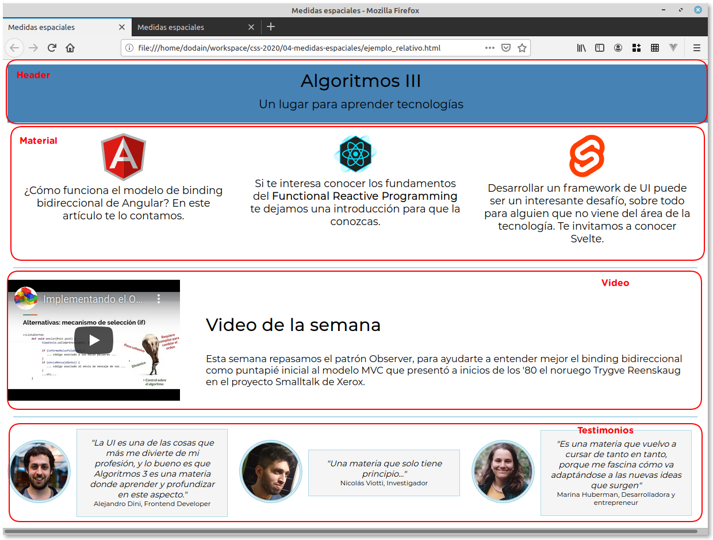
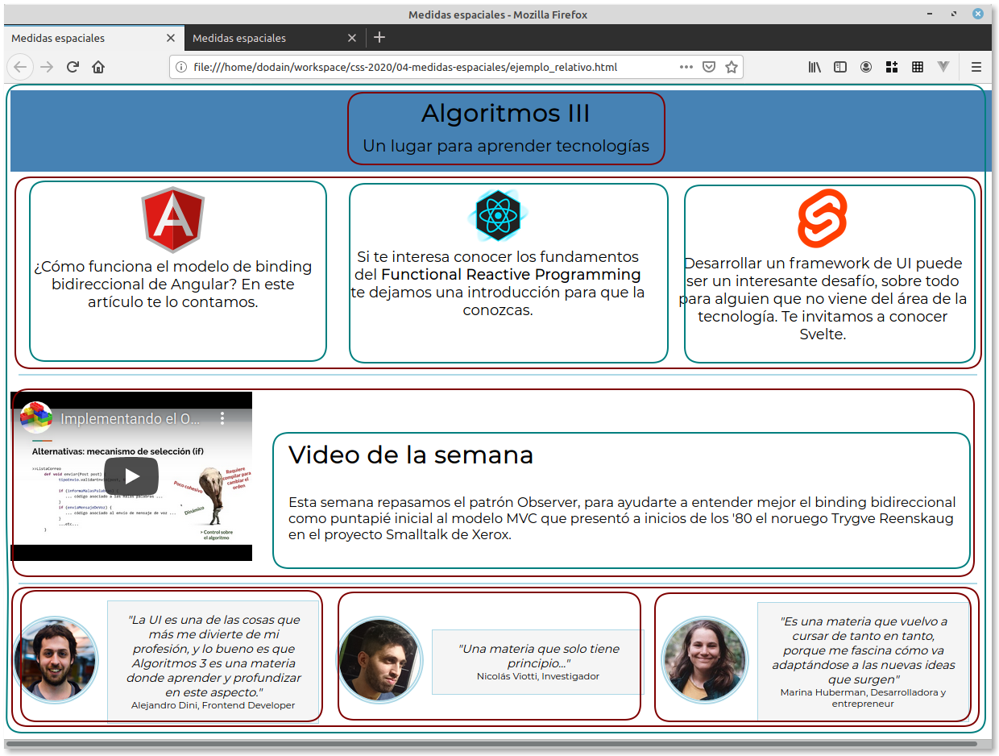
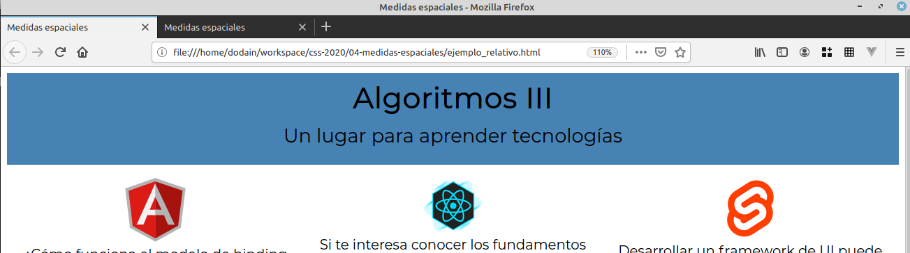
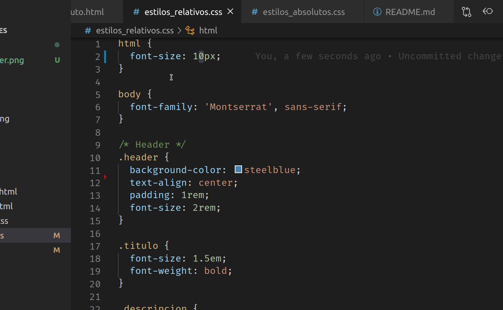

# Medidas espaciales

En este ejemplo, vamos a estudiar un poco diferentes estrategias a la hora de definir tamaños para nuestro font y qué otras medidas puede afectar.

## Absoluto vs. relativo

A la hora de definir medidas, tenemos muchas variantes:

- píxeles (px), pulgadas (in), puntos (pt), centímetros (cm), milímetros (mm) y algunas otras medidas **absolutas**
- y las siguientes medidas **relativas**
  - em: toma como base el tamaño de la fuente del elemento padre
  - rem: toma como base el tamaño de la fuente del elemento raíz (el del `body`)
  - vh / vw: viewport height o viewport width, toma el 1% del tamaño del dispositivo (el tamaño variará dependiendo de que estés trabajando en un celular, una tablet, una ventana desktop o una de pantalla ancha)

Definir esto puede ser un poco confuso, en especial lo similar que parecen las definiciones de _em_ y _rem_, pero vamos a mostrarlo con un ejemplo.

## El ejemplo

El ejemplo se basa en una página que cuenta las bondades de una materia que enseña Interfaces de Usuario en una universidad:



Como ven, podemos reconocer cuatro secciones:

- el header, que identifica el nombre de la materia y una breve descripción, dispuestos en un layout vertical, es decir cada uno ocupa una línea.
- el material, que tiene links a tres tecnologías. Aquí el layout es mixto: el contenedor tiene un layout horizontal, cada tecnología representa una columna, mientras que internamente el ícono y una breve descripción van con un layout vertical.
- el video de la semana, cuyo contenedor utiliza un layout horizontal, y luego separamos el título del video de la semana y la descripción con un layout vertical
- y por último, los testimonios, que se forman con un contenedor cuyo layout es horizontal, y también es horizontal cada testimonio (la foto y la cita)

Gráficamente:



- en verde marcamos los layouts verticales, `flex-direction: column`
- en marrón los layouts horizontales, `flex-direction: row`

aunque más adelante habrá un ejemplo para profundizar sobre este modo de display.

### Dónde usamos porcentajes

Por una cuestión de comodidad, vamos a considerar porcentajes en los siguientes casos:

- width, 100% en todos los contenedores, y en las citas de los testimonios. Esto permite que lo puedas ver bien en cualquier dispositivo. Otra opción equivalente podría ser considerar `width: 100vw;` ([viewport width](https://developer.mozilla.org/es/docs/M%C3%B3vil/Viewport_meta_tag))
- 50% de border-radius para lograr que la foto se vea redonda

### Versión absoluta: trabajo con píxeles

La variante absoluta trabaja todo con píxeles: la ventaja que tiene es que podemos fijar exactamente el tamaño que queremos (podés ver [este artículo que habla sobre cómo hacer diseños web _pixel perfect_](https://thewhitelabelagency.com/pixel-perfect-web-development-5-essential-steps/)). La desventaja es fácil de imaginar: si el usuario no está satisfecho y nos pide que

- agrandemos el título y la descripción un poco más
- y achiquemos un poco el font de material

eso exige que tengamos que actualizar los tamaños de cada fuente en forma manual, sin contar que posiblemente el usuario no haya tenido en cuenta otras medidas espaciales importantes, como el padding, el margin o el borde.

Podés ver cómo resolvimos la página en el archivo [ejemplo_absoluto.html](./ejemplo_absoluto.html), con su archivo de estilos [estilos_absolutos.css](./estilos_absolutos.css).

### Versión relativa: una posible estrategia

Ok, sabemos que la variante absoluta es un poco rígida, pero muchas veces los conceptos `em` y `rem` generan mucha confusión, sin contar que hay adeptos a usar uno u otro. Nosotros vamos a proponer una tercera idea:

- primero que nada, definiremos el tamaño base en nuestro **root element** html:

```css
html {
  font-size: 10px;
}
```

Algunos diseñadores suelen usar el equivalente en porcentajes, donde 100% representan 16 píxeles y 62,5% son 10 píxeles, el ideal para facilitar las cuentas posteriores.

- a partir de aquí, cada contenedor principal va a definir sus font-sizes, paddings, margins en base al elemento raíz (que estará basado en 10 píxeles o el tamaño que nos resulte más apropiado), por eso vamos a usar `rem`. Por ejemplo, el _header_ define

```css
.header {
  ...
  padding: 1rem;
  font-size: 2rem;
}
```

esto implica que el padding real será de 1 * 10px = 10 píxeles, y el tamaño de la fuente será de 2 * 10px = 20 píxeles.

- los elementos hijos de cada contenedor en lugar de apuntar al _root element_, van a usar `em`, esto implica que tomarán los valores que cada contenedor padre le establezca. Entonces, el título con el que mostramos "Algoritmos III" dice

```css
.titulo {
  font-size: 1.5em;
  ...
```

esto implica que tomará 1.5 * 20 píxeles (del header que definimos antes) = 30 píxeles. Si en lugar de `em` hubiéramos definido `font-size: 1.5rem;` el tamaño de la letra habría sido mucho más chico: 1.5 * 10 píxeles = 15 píxeles. Te invitamos a que hagas las pruebas.

## Resumen de nuestra propuesta

- el elemento raíz (html) marca el tamaño por defecto, ya sea en píxeles o en porcentaje. La recomendación es tomar 10 píxeles o su equivalente, 62.5% para facilitar las cuentas
- los elementos contenedores toman como base el root element, se configuran en `rem`
- los hijos del contenedor trabajan con `em`, que es la medida relativa al tamaño que define su contenedor padre.

Entonces, 

- si quieren agrandar o achicar todo, cambiamos el tamaño del elemento raíz.
- si nos piden agrandar o achicar alguno de los contenedores, modificamos el `rem` de la medida base.
- si hay que hacer un cambio específico de algún elemento, se modifica su `em`

## Implementando los cambios

### Agrandar título y descripción

Entonces, si nos piden que agrandemos el título y la descripción un poco más:

```css
.header {
  ...
  font-size: 2.5rem;
}
```

Solo necesitamos definir un font-size en el header de 2.5 * 10 píxeles = 25 píxeles:



- la descripción toma 25 píxeles en lugar de los 20 originales
- el título era de 1.5em = 1.5 * 25 píxeles = 37.50 píxeles

Ambos se incrementan solos, e incluso el margen de la descripción:

```css
.descripcion {
  margin: 0.5em;
}
```

Pasa de 10 píxeles a 12.5 píxeles.

La ventaja es que cada contenedor mantiene su tamaño.

### Achicar un poco el font del material

Esto es más específico, pero como definimos la descripción del material de la siguiente manera:

```css
.material_elemento {
  ...
  font-size: 1.2em;
}
```

Es cuestión de bajar la letra del material a `font-size: 1.1em` o directamente borrar esa línea y mantener la definición del contenedor del material:

```css
.material_contenedor {
  ...
  font-size: 1.5rem;
}
```

es decir: 1.5 * 10 píxeles (el elemento raíz) = 15 píxeles. Te invitamos a que lo pruebes vos.

### Queremos agrandar la letra de todo

Bueno, nuevamente es fácil, si modificamos el font-size del elemento raíz:

```css
html {
  font-size: 12px;
}
```

Toda la página se acomoda (incluso el manejo espacial de paddings, margins se mantiene):



